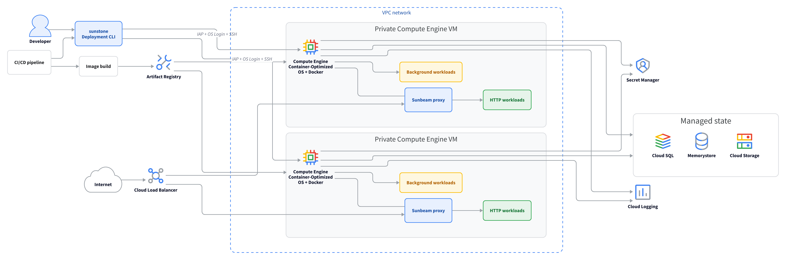

# Sunstone

**Deploy containers without deploying an orchestrator.**

Sunstone deploys container images directly to Google Cloud VMs while the machines and surrounding infrastructure remain yours.

> Sunstone is under development.

## Principles

Orchestrators like Kubernetes solve important problems. For applications that fit comfortably on a few VMs, Sunstone follows a simpler path.

1. **Pay for workloads, not orchestration.** A few well-sized VMs can take an application far.
2. **Zero downtime for HTTP workloads.** Sunstone switches traffic only after the replacement is ready.
3. **Security comes first.** Sunstone builds on GCP’s security model to make good practices part of every deployment.
4. **Keep deployment direct.** Sunstone talks to machines without a control plane in between.
5. **Leave state to managed services.** Databases and durable data deserve systems built to protect them.

## How Sunstone works



A workload runs one container on one or more VMs. Sunstone replaces containers one VM at a time.

For HTTP workloads, the replacement starts alongside the container serving traffic. Sunbeam switches traffic after the replacement is ready, then drains and stops the old container. Background workloads stop cleanly before their replacements start.

You provision projects, networks, IAM, VMs, and load balancers separately.

## Commands

Use `-f` to pass a workload file or directory.

```text
sunstone deploy  -f FILE_OR_DIRECTORY
sunstone status  -f FILE_OR_DIRECTORY
sunstone restart -f FILE_OR_DIRECTORY
sunstone remove  -f FILE_OR_DIRECTORY
```

- `deploy` validates and deploys the workload.
- `status` reports its state on each VM.
- `restart` restarts it one VM at a time.
- `remove` drains traffic and removes it while leaving the VMs and Sunbeam running.

Run `sunstone COMMAND --help` for complete usage and options.

## Configuration

Each YAML document defines one workload and one container.

```yaml
name: storefront-web

gcp:
  project: acme-prod
  instances:
    - zone: us-central1-a
      name: storefront-1
    - zone: us-central1-b
      name: storefront-2

container:
  image: us-central1-docker.pkg.dev/acme-prod/apps/storefront
  command: ["bin/web"]

  env:
    APP_ENV: production
    DATABASE_URL:
      secret: projects/acme-prod/secrets/database-url/versions/latest

  resources:
    cpu:
      shares: 1024
    memory:
      limit: 512MiB

  readinessProbe:
    httpGet:
      path: /up
      port: 3000

http:
  port: 3000
  routes:
    - host: shop.example.com
```

Sunstone configures CPU and memory differently because they behave differently when containers share a VM. CPU is compressible. A container can receive less CPU and keep running, only more slowly. CPU shares only matter when the VM is busy. Containers with more shares get more CPU. When the VM has spare CPU, any container can use it.

Memory is incompressible. A container cannot adapt to memory pressure merely by running more slowly. A hard memory limit protects other workloads on the host, and exceeding it can cause an out-of-memory kill.

HTTP workloads and background workloads use the same configuration format. Here is a background workload using that format.

```yaml
name: storefront-jobs

gcp:
  project: acme-prod
  instances:
    - zone: us-central1-a
      name: storefront-jobs-1

container:
  image: us-central1-docker.pkg.dev/acme-prod/apps/storefront
  command: ["bin/jobs"]
```

## Inspiration

- [Kamal](https://kamal-deploy.org/) for its imperative deployment workflow.
- [Knative](https://knative.dev/) for its workload and traffic model.
- [Cloud Run](https://cloud.google.com/run) for its container configuration and Google Cloud integration.
